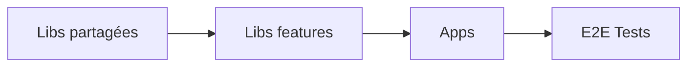
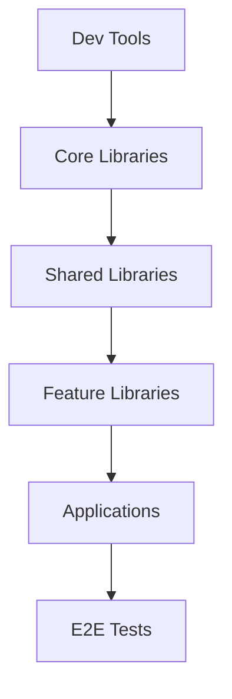

# Migration de Monorepo Angular

Ce guide détaille les stratégies et bonnes pratiques pour migrer des monorepos Angular.

## 📚 Introduction

Un monorepo Angular peut contenir :
- Plusieurs applications Angular
- Des bibliothèques partagées
- Des outils et scripts communs
- Des micro-frontends

## 🏗️ Structures de monorepo supportées

### 1. Nx Workspace

```
monorepo/
├── apps/
│   ├── app1/
│   ├── app2/
│   └── app3-e2e/
├── libs/
│   ├── shared/ui/
│   ├── shared/data-access/
│   └── feature/auth/
├── tools/
├── nx.json
├── workspace.json
└── package.json
```

### 2. Angular Workspace

```
monorepo/
├── projects/
│   ├── app1/
│   ├── app2/
│   ├── lib-shared/
│   └── lib-ui/
├── angular.json
├── package.json
└── tsconfig.json
```

### 3. Lerna + Yarn Workspaces

```
monorepo/
├── packages/
│   ├── @company/app1/
│   ├── @company/app2/
│   ├── @company/shared/
│   └── @company/ui/
├── lerna.json
├── package.json
└── yarn.lock
```

## 🔍 Analyse préliminaire

### 1. Analyser l'ensemble du monorepo

```bash
# Depuis la racine du monorepo
ng-migrate analyze --monorepo

# Ou avec configuration spécifique
ng-migrate analyze --config .ng-migrate.monorepo.json
```

### 2. Analyser par workspace

```bash
# Analyser une app spécifique
ng-migrate analyze --project app1

# Analyser toutes les libs
ng-migrate analyze --projects "libs/*"
```

### 3. Générer un rapport consolidé

```bash
ng-migrate analyze --monorepo --format html --output monorepo-report.html
```

## 📋 Stratégies de migration

### Stratégie 1 : Migration Progressive

Migrer projet par projet en commençant par les dépendances.



#### Étapes :

1. **Identifier les dépendances**
   ```bash
   ng-migrate deps-graph --output deps.svg
   ```

2. **Migrer les libs de base**
   ```bash
   # Lib shared-utils
   ng-migrate analyze --project shared-utils
   ng update @angular/core@18 --project shared-utils
   ```

3. **Migrer les libs features**
   ```bash
   # Pour chaque lib feature
   ng-migrate analyze --project feature-auth
   ng update @angular/core@18 --project feature-auth
   ```

4. **Migrer les applications**
   ```bash
   # Pour chaque app
   ng-migrate analyze --project app1
   ng update @angular/core@18 --project app1
   ```

### Stratégie 2 : Migration Big Bang

Migrer tout le monorepo en une fois.

```bash
# Analyse globale
ng-migrate analyze --monorepo

# Backup complet
git checkout -b migration/angular-18-all
git add -A && git commit -m "backup: pre-migration"

# Migration globale
ng update @angular/core@18 @angular/cli@18
```

### Stratégie 3 : Migration Hybride

Certains projets restent sur l'ancienne version temporairement.

```json
// angular.json avec versions mixtes
{
  "projects": {
    "legacy-app": {
      "architect": {
        "build": {
          "options": {
            "preserveSymlinks": true,
            // Utilise l'ancien builder
            "builder": "@angular-devkit/build-angular:browser"
          }
        }
      }
    },
    "modern-app": {
      "architect": {
        "build": {
          // Nouveau builder
          "builder": "@angular-devkit/build-angular:application"
        }
      }
    }
  }
}
```

## 🔧 Configuration spécifique monorepo

### .ng-migrate.monorepo.json

```json
{
  "monorepo": true,
  "analysis": {
    "workspaces": true,
    "projectPatterns": [
      "apps/*",
      "libs/*",
      "packages/@company/*"
    ],
    "excludeProjects": [
      "legacy-app",
      "*-e2e"
    ],
    "sharedDependencies": true
  },
  "output": {
    "groupByWorkspace": true,
    "consolidatedReport": true
  },
  "migration": {
    "strategy": "progressive",
    "batchSize": 5,
    "testAfterEach": true
  }
}
```

### Scripts de migration

```json
// package.json
{
  "scripts": {
    "migrate:analyze": "ng-migrate analyze --monorepo",
    "migrate:libs": "ng-migrate batch --projects 'libs/*'",
    "migrate:apps": "ng-migrate batch --projects 'apps/*'",
    "migrate:test": "nx affected:test --base=main",
    "migrate:verify": "ng-migrate doctor --monorepo"
  }
}
```

## 🚨 Défis spécifiques aux monorepos

### 1. Versions conflictuelles

```bash
# Détecter les conflits
ng-migrate conflicts --monorepo

# Résultat exemple
┌─────────────┬──────────────┬─────────────┐
│ Package     │ App1         │ Lib-shared  │
├─────────────┼──────────────┼─────────────┤
│ @angular/core│ ^17.0.0     │ ^16.2.0     │
│ rxjs        │ ^7.8.0      │ ^7.5.0      │
└─────────────┴──────────────┴─────────────┘
```

**Solution** : Aligner les versions
```bash
# Forcer une version unique
npm install @angular/core@18.0.0 --workspace-root
```

### 2. Dépendances circulaires

```bash
# Détecter les dépendances circulaires
ng-migrate analyze --check-circular

# Visualiser
ng-migrate deps-graph --highlight-circular
```

### 3. Tests d'intégration

```typescript
// test-migration.spec.ts
import { runCLI } from '@nrwl/devkit';

describe('Migration Tests', () => {
  it('should build all projects', async () => {
    const { stdout } = await runCLI('build --all');
    expect(stdout).toContain('Successfully built');
  });

  it('should pass all tests', async () => {
    const { stdout } = await runCLI('test --all');
    expect(stdout).not.toContain('FAILED');
  });
});
```

## 📊 Monitoring de la migration

### Dashboard de progression

```bash
# Générer un dashboard
ng-migrate monitor --monorepo --format dashboard
```

Affiche :
- Progression par projet
- Tests réussis/échoués
- Taille des bundles
- Temps de build

### Métriques clés

```typescript
// migration-metrics.ts
interface MigrationMetrics {
  totalProjects: number;
  migratedProjects: number;
  failedProjects: number;
  buildTime: {
    before: number;
    after: number;
    improvement: string;
  };
  bundleSize: {
    before: number;
    after: number;
    improvement: string;
  };
}
```

## 🔄 Rollback Strategy

### 1. Branches de feature

```bash
# Créer une branche par projet
git checkout -b migration/lib-shared
# Migrer
# Tester
# Merger si OK
```

### 2. Feature flags

```typescript
// environment.ts
export const environment = {
  useNewAngular: process.env['USE_NEW_ANGULAR'] === 'true'
};

// main.ts
if (environment.useNewAngular) {
  bootstrapApplication(AppComponent, newConfig);
} else {
  platformBrowserDynamic().bootstrapModule(AppModule);
}
```

### 3. Backup et restore

```bash
# Script de backup
#!/bin/bash
tar -czf backup-$(date +%Y%m%d).tar.gz \
  --exclude=node_modules \
  --exclude=dist \
  .

# Script de restore
tar -xzf backup-20240315.tar.gz
npm ci
```

## 🏆 Best Practices

### 1. Ordre de migration



### 2. Tests continus

```yaml
# .github/workflows/migration-test.yml
name: Migration Tests
on:
  push:
    branches: [migration/*]

jobs:
  test:
    runs-on: ubuntu-latest
    strategy:
      matrix:
        project: [app1, app2, lib-shared]
    steps:
      - uses: actions/checkout@v3
      - run: npm ci
      - run: npm run test:${{ matrix.project }}
      - run: npm run build:${{ matrix.project }}
```

### 3. Documentation

```markdown
# Migration Log

## Phase 1: Core Libraries (Semaine 1)
- ✅ @company/core - Migré le 15/03
- ✅ @company/utils - Migré le 16/03
- ⏳ @company/ui - En cours

## Phase 2: Applications (Semaine 2)
- ⏸️ app-admin - En attente
- ⏸️ app-customer - En attente
```

## 📈 Optimisations post-migration

### 1. Shared builds

```json
// nx.json
{
  "tasksRunnerOptions": {
    "default": {
      "runner": "@nrwl/nx-cloud",
      "options": {
        "cacheableOperations": ["build", "test", "lint"],
        "parallel": 3
      }
    }
  }
}
```

### 2. Incremental builds

```bash
# Construire seulement ce qui a changé
nx affected:build --base=main --head=HEAD
```

### 3. Module Federation

```typescript
// webpack.config.js pour micro-frontends
const ModuleFederationPlugin = require("webpack/lib/container/ModuleFederationPlugin");

module.exports = {
  plugins: [
    new ModuleFederationPlugin({
      name: "shell",
      remotes: {
        mfe1: "mfe1@http://localhost:4201/remoteEntry.js",
        mfe2: "mfe2@http://localhost:4202/remoteEntry.js"
      }
    })
  ]
};
```

## 🆘 Troubleshooting

### Problème : "Cannot find module" après migration

```bash
# Nettoyer et reconstruire
rm -rf node_modules dist .angular
npm ci
nx reset
nx build --all
```

### Problème : Tests qui échouent aléatoirement

```typescript
// Augmenter les timeouts pour les gros monorepos
// karma.conf.js
module.exports = function(config) {
  config.set({
    browserNoActivityTimeout: 60000,
    browserDisconnectTimeout: 60000
  });
};
```

### Problème : Mémoire insuffisante

```bash
# Augmenter la mémoire Node
export NODE_OPTIONS="--max-old-space-size=8192"
nx build --all
```

## 📚 Ressources

- [Nx Monorepo Guide](https://nx.dev/guides/monorepo)
- [Angular Workspace Guide](https://angular.io/guide/file-structure#multiple-projects)
- [Lerna Documentation](https://lerna.js.org/)
- [Module Federation avec Angular](https://www.angulararchitects.io/en/aktuelles/the-microfrontend-revolution-module-federation-in-webpack-5/)

## Checklist finale

- [ ] Analyse complète du monorepo
- [ ] Plan de migration documenté
- [ ] Backup complet effectué
- [ ] Dependencies alignées
- [ ] Migration des core libs
- [ ] Migration des shared libs
- [ ] Migration des apps
- [ ] Tests E2E passent
- [ ] Performance vérifiée
- [ ] Documentation mise à jour
- [ ] CI/CD adapté

## Prochaines étapes

- [Intégration CI/CD](ci-cd-integration.md)
- [Optimisation des performances](../optimization/performance.md)
- [Module Federation](../advanced/module-federation.md)